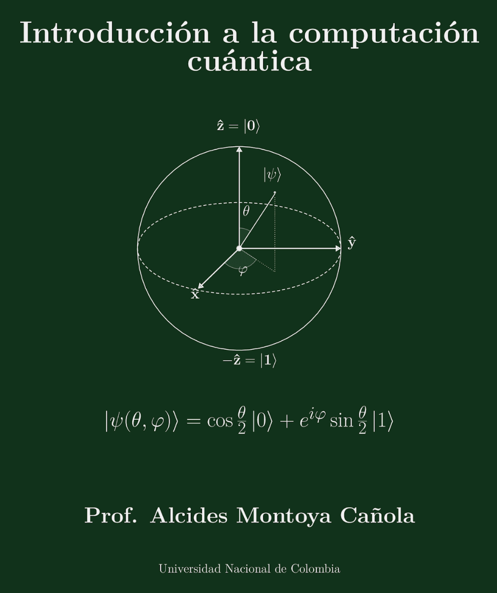

---
hide:
  - navigation
  - toc
---

Centro de Excelencia en Computación Cuántica e Inteligencia Artificial

# Introducción a la computación cuántica

Un espacio de estudio en español: del qubit a los algoritmos. Diapositivas, videos, prácticas de código y ejercicios. Departamento de Física — Universidad Nacional de Colombia, Sede Medellín.

[Empezar el curso](curso/index.md){ .qc-btn .primary }
[Ver el libro](libro/index.md){ .qc-btn .ghost }
[Unirse a la clase en vivo](https://meet.google.com/keq-szhh-hsp){ .qc-btn .ghost }

<b>Lunes y miércoles</b> Clases en vivo
<b>5:00 – 7:00 p. m.</b> Hora de Colombia
<b>Google Meet</b> meet.google.com/keq-szhh-hsp

## ¿Qué encuentras en cada sección?

Usa el menú de arriba para navegar. Esto es lo que hay en cada sección:

-   :material-school:{ .lg .middle } __Curso__

    ---

    El corazón del sitio. Una página por **clase**, con el **video** de YouTube, las **diapositivas**, la **práctica** de código y los **ejercicios** de ese día.

    [:octicons-arrow-right-24: Ir al curso](curso/index.md)

-   :material-book-open-variant:{ .lg .middle } __Libro__

    ---

    El libro guía por **capítulos**: un resumen de cada uno, sus diapositivas y —cuando estén disponibles— los PDF del capítulo para leer.

    [:octicons-arrow-right-24: Ver capítulos](libro/index.md)

-   :material-laptop:{ .lg .middle } __Prácticas__

    ---

    Los **notebooks** de Python/Qiskit, uno por tema, listos para ejecutar en Google Colab sin instalar nada.

    [:octicons-arrow-right-24: Ir a prácticas](practicas/index.md)

-   :material-pencil-ruler:{ .lg .middle } __Ejercicios__

    ---

    Series de ejercicios por capítulo, con **pistas y soluciones** plegables para que primero intentes y luego verifiques.

    [:octicons-arrow-right-24: Resolver ejercicios](ejercicios/index.md)

-   :material-bookshelf:{ .lg .middle } __Recursos__

    ---

    Bibliografía, **papers** comentados con enlace a arXiv y las **herramientas** (SDKs y simuladores) que usamos en el curso.

    [:octicons-arrow-right-24: Ver recursos](recursos/index.md)

-   :material-atom:{ .lg .middle } __El Centro__

    ---

    Quiénes somos: el Centro de Excelencia y el Departamento de Física de la Universidad Nacional de Colombia, Sede Medellín.

    [:octicons-arrow-right-24: Conócenos](centro/index.md)

!!! tip "¿Nuevo por aquí?"
    Empieza por la **Clase 1** en la sección [Curso](curso/index.md). Cada clase reúne todo lo que necesitas: mira el video, sigue las diapositivas y resuelve la práctica y los ejercicios. Si no puedes conectarte en vivo, todas las clases quedan grabadas.

---

<small>Sitio abierto para la comunidad hispanohablante interesada en la computación cuántica. Contenido bajo licencia CC BY-SA 4.0.</small>
